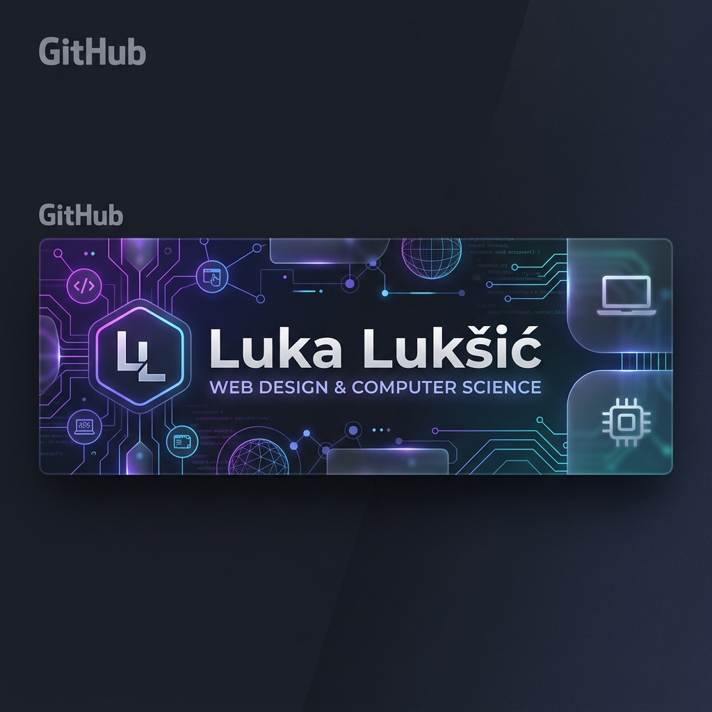

<h1 align="center">
  
</h1>

<h2 align="center">👋 Hello, I me Luka Lukšić!</h2>

  <strong>Computer Technician | Web Designer | Student at <a href="https://www.tvz.hr">TVZ Zagreb</a></strong>

  

---

### 🚀 About Me
I'm a passionate web design student from Croatia with a deep background in computer technology and game development.
- 🎓 **Education:** Graduated High School in Computer Technology; currently studying Web Design at **TVZ Zagreb**.
- 🎮 **Game Dev:** I specialize in **Unreal Engine 5 (C++)**, creating multiplayer experiences and custom gameplay mechanics.
- 🎨 **Creative Design:** Expert in Adobe Creative Suite, focusing on high-end visual experiences and motion graphics.
- 🛠️ **Problem Solver:** From precision technical work to complex code replication, I love bringing ideas to life.

---

### 🌐 Connect with Me

---

### 🛠️ Languages & Tools

#### 💻 Development & Databases

  
  
  
  
  
  
  
  
  

#### 🎨 Game Dev & Creative Design

  
  
  
  
  

---

### 📊 GitHub Stats

  
  

---
